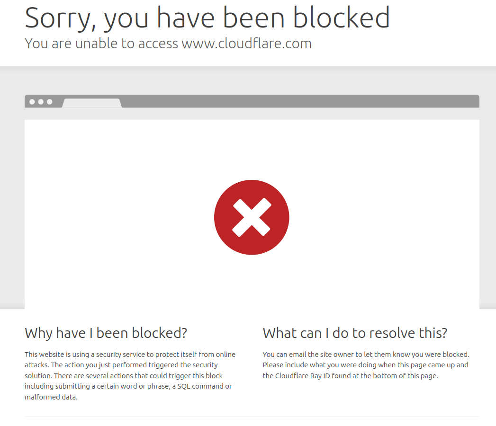

# Table of Contents

- [bypass-waf](#bypass-waf)
  - [Overview](#Overview)
  - [List of Bypassed WAFs](#List-of-Bypassed-WAFs)
      - [Cloudflare Bypass PoC](#Cloudflare-Bypass-PoC)

# bypass-waf
Web Application Firewalls (WAFs) are a common security layer designed to detect and block malicious traffic. However, no WAF is perfect. This repository documents modern, practical techniques for bypassing popular WAFs in real-world scenarios. The goal is to help offensive security professionals, penetration testers, and researchers understand WAF behavior, improve evasion strategies, and stay ahead in the constantly evolving field of web security.

  

## Overview

Many Web Application Firewalls implement inspection limits on incoming requests to balance security with performance. Typically, WAFs analyze only a portion of the request body—often the first few kilobytes—before allowing the traffic to pass. This limitation exists because deep inspection of large request payloads requires significant processing power and can introduce latency, which cloud-based WAFs and other commercial solutions strive to minimize. As a result, attackers can sometimes bypass detection by sending payloads that exceed the WAF’s inspection size limit, embedding malicious content beyond the inspected portion. This "large size bypass" technique exploits the fundamental trade-off between thorough inspection and performance constraints common to most WAFs, allowing evasion across various vendors and deployments.

  

## List of Bypassed WAFs

This section lists the WAFs that have been tested and bypassed, including the vendor, technique used, status of the test, and a link to the corresponding Proof of Concept (PoC) further below.

| WAF Name         | Vendor            | Bypass Technique                | Status       | PoC Section         |
|------------------|-------------------|----------------------------------|--------------|----------------------|
| Cloudflare WAF          | Cloudflare | Large Payload (8KB limit)        | ✅ Bypassed   | [See PoC](#aws-waf-poc) |
| AWS WAF   | Amazon Web Services | TBD                              | ⏳ Testing    |                      |
| Azure WAF        | Microsoft Azure    | TBD                              | ⏳ Testing    |                      |
| Imperva WAF      | Imperva            | TBD                              | ⏳ Testing    |                      |
| F5 BIG-IP WAF    | F5 Networks        | TBD                              | ⏳ Testing    |                      |
| ModSecurity      | Open Source        | TBD                              | ⏳ Testing    |                      |

### Cloudflare Bypass PoC
